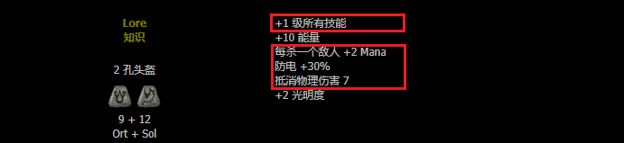
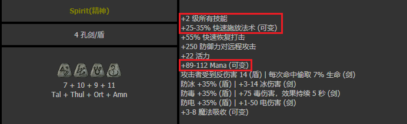
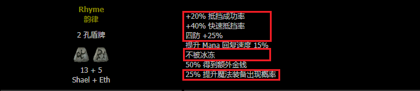
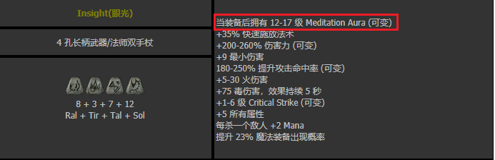

# 装备篇
## 基本知识：
### **装备级别**  
同一*种目*装备分为普通级-扩展级-精华级。可以简单理解为普通难度-噩梦难度-地狱难度的装备。同一种目的不同级别装备**只有基础属性**（防御力/攻击力）不同（部分装备最大孔数不同）。  
- 对于暗金：同一种目不同级别有不同的暗金装备。  
- 对于符文之语：不影响符文之语的属性。  
- 意义：对于物理系角色，由于级别越高基础攻击力越高，所以武器级别**很重要**。
### **无形装备** *（不追求）*  
无形装备由于
- 基础属性比有形装备高
- 无法修理  
因此是给佣兵使用的装备的升级版。（佣兵只能装备头盔，盔甲和武器）无形手套鞋子腰带等于废物。
### **白色带孔装备** *（重要）*  
符文之语的素材，被称为**底材**，详细见符文之语篇。

## 装备定位：
### **符文之语** *（重要）*  
**低级**符文之语：开荒必备，容易**定向**获取，性价比最强。  
**高级**符文之语：游戏终极追求之一。  
- 特点：通过符文**按顺序**镶嵌**白色**带孔装备获得，可视为一种特殊的暗金。   
- 总体评价: 暗黑2装备玩法**最精髓**部分。
### **暗金装备** *（重要）*   
**普通级**暗金装备：部分可用于前期过渡，大部分不如低级符文之语。  
**扩展级、精华级**暗金装备：部分装备为某些角色玩法必备，或终极追求。部分可以作为没有高级符文之语时候的代替品。  
- 特点：无法**定向**获取，刷刷刷看脸。强的暗金装备很强，弱的暗金装备基本没用。  
- 总体评价：与符文之语互为补充。*需要刷*
### **绿色装备** *（不追求）*  
低级绿色装备：基本没用，运气好可用于前期过渡。  
高级绿色装备：小部分单件有用。
- 特点：无法**定向**获取，凑一套比暗金更看脸。不用特地追求。

## 装备攻略：
### **符文之语**  
符文之语的制造需要
- **底材**：带**特定孔数**的**特定种类**的**白色**装备  
主要获得途径：平时注意掉落的灰色带孔装备和白色装备，和通关后的秘密奶牛关
- **符文**：**特定号数**的符文数个进行**特定顺序**镶嵌  
主要获得途径：小怪掉落和刷女伯爵（普通：1-9，恶梦1-16， 地狱1-24）  
基本上18号以上符文属于**较难掉落**，24号以上符文属于**非常值钱的大号符文**  
------------
资料：
- 镶嵌公式：  
http://bbs.anhei2.com/diablo/runewords.html

- 符文   
号数与女伯爵掉落：  
https://wiki.d.163.com/index.php?title=%E7%AC%A6%E6%96%87%E5%88%97%E8%A1%A8_(Diablo_II)  
合成公式：  
http://bbs.anhei2.com/thread-23-1-1.html

- 白色装备（底材）资料：  
快速查询：  
https://www.cnbn.vip/items/weaponsandarmor.html#normal  
详细一览：  
http://bbs.anhei2.com/thread-15638-1-1.html

- 打孔资料：  
ACT5拉苏克打孔表：  
https://wiki.d.163.com/index.php?title=%E6%A8%A1%E6%9D%BF:%E8%A3%85%E5%A4%87%E6%9C%80%E5%A4%A7%E5%AD%94%E6%95%B0%E8%A1%A8  
方块打孔公式：  
http://bbs.anhei2.com/viewthread.php?tid=15601&extra=page%3D1&page=1&1

- 物品等级：  
说明：  
http://bbs.anhei2.com/thread-21140-1-1.html  
场景与怪物等级：  
http://bbs.anhei2.com/thread-15611-1-3.html

-----------------

**推荐**  
法系前期一套：(遇到底材记得存仓库)
- 人物（按照容易获取的顺序先后）  
底材：任意2孔盔甲（推荐2孔胸铠）

底材：任意2孔头盔

底材：4孔水晶剑（普通ACT5或牛场刷出白板，拿去拉苏克打孔）

底材：2孔骨盾（ACT2卓格南可刷）

其中，**精神**最为重要，
------------
- 雇佣兵（ACT2）
底材：2孔**长柄武器**（注意，矛类武器不行）

底材：4孔**长柄武器**（注意，矛类武器不行），普通牛场或恶梦容易出

**眼光**提供高等级冥想光环，配合**精神**，基本解决法系蓝量问题。